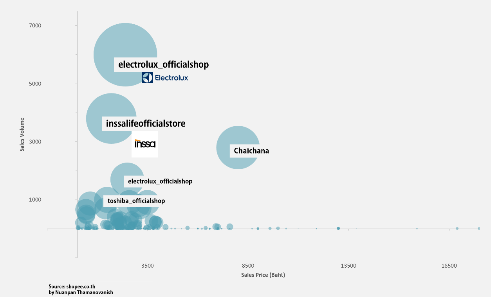

# Thailand: Popular microwave and oven stores on Shopee, November 2022

Electrolux is the best-selling microwave and oven brand in Shopee – an e-Commerce marketplace in Thailand. Electrolux microwave oven with an added grill function triumphed as the most purchased product, with more than 6000 items sold as of November 2022 and priced under 3,500 baht as most household microwaves and oven brands.

The second most-preferred store is INSSA. It offers a wide variety of brands with Korean/Japanese-inspired designs and a hint of minimalism – the design philosophy that has commonly seen in Thai households.

Chaichana store is leading in the sales of microwaves and ovens intended for commercial and industrial purposes. The store’s most-purchased product is the commercial oven with 3,200 watts, with almost 3,000 items sold as of November 2022 and priced at around 8,000 baht. 